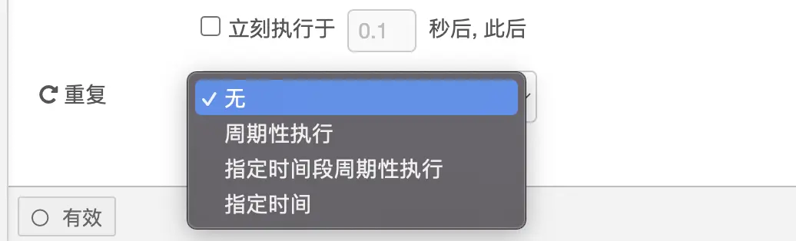

## 什么是node-red
Node-RED是建物联网(`IOT，` Internet of Things)应用程序的一个强大工具。与前端开发构建相同，Node-RED也有自己的生态社区，[中文地址](https://www.iotschool.com/topics/node81)。
作为一个开源项目，Node-Red由JavaScript语言写成，所以非常适合Js语言从业者使用，Node-Red运行在Node平台。

Node-Red基于低代码的开发思想，有以下Node-RED 特点：

1.相较于撰写程序代码，使用图形化界面可更快速开发。

2.适合作为概念性应用验证的开发工具。

3.浅显易懂，每个 API 都有文字说明可供查询。

4.具有高度扩充性，已有大量的 Library、Flow、Node 供人下载。

## 简单使用
### NPM安装

1. 全局下载
```js
npm install -g
```
2. 启动
```js
nodo-red
```
### 容器安装
1. 第一步下载镜像
```js
docker pull nodered/node-red
```
2. 第二步启动镜像
```js
 sudo docker run -it -p 1880:1880 --name=nodered --restart=always --user=root --net=host -v /data/nodered:/data -e TZ=Asia/Shanghai nodered/node-red
```
3. 第三步打开浏览器访问
```js
访问http://{host-ip}:1880 
```
就能够进入Node-RED的操作页面了。

Node-RED 截止目前共有 42 个逻辑节点，按照共通、功能、网络、序列、解析、存储分为六大类。
所有节点都可能有左右连接点，左连接点是输入，右连接点是输出，特殊节点可能有多个输入或多个输出，其实对应代码也不难理解，就是入参和出参。

### 共通
- inject
手动输入节点。可以定期产生一些输入，由下一个节点消费。
当然这里是用 UI 表单配置的：


之后就是消费，几乎后面任何节点都可以消费，比如利用change节点来设置一些环境变量时，或者利用 template节点设置html模版时，都可以拿到这里输入的变量。如果在模版里，变量通过 {{msg.payload}}访问，如果是其它表单，甚至可以通过下拉框直接枚举选择。

然而这个节点往往用来设置静态变量，更多的输入情况是来自其它程序或者用户的，比如http in，这个后面会讲到。其实通过这种组合关系，我们可以把任意节点的输入从生产节点替换为inject节点，从而实现一些 mock效果，而inject节点也支持配置定时自动触发：

- debug
调试节点，当输出节点连接到 debug 的输入后，将会在控制台打印出输出信息，方便调试。
例如：我想要每天早上六点获取本地的天气，我们就可以这样写


点击部署按钮，之后执行inject，就会在控制台输出如图所示


其他节点的使用在后续更新

## 总结

使用`node-red`开发跟传统前后端开发没什么区别，只不过`node-red`融入了低代码的思想，将传统的代码编写改为可视化拖拽方式，极大减少了开发时间，缩短开发周期，可复用性也得到了提升。
`node-red`为物联网而生，也应该应用在物联网领域

1. 物联网数据来源
物联网的数据传感器上获取，配置设备网关后就可以查看导出数据

2. **展示操作数据**

使用Node-RED搭建一个物联网服务

转载地址51CTO博客：[51CTO博客](https://blog.51cto.com/u_16011718/6127877)

### node-red与Bpmn2.0区别

| **名称** | 作用范围 | 是否可视化操作 | 组件节点 | 扩展性 | 网络协议|
| --- | --- | --- | --- | --- |  --- |  --- |  --- | 
| **Node-Red** | 行业级别，搭建完整应用 | 是 | 节点功能| 可扩展| HTTP\MQTT\蓝牙...|
| **BPMN2.0** | 应用级别，作为应用的某个功能 | 是 | 基础元模型|不可扩展| BPMN2.0协议|