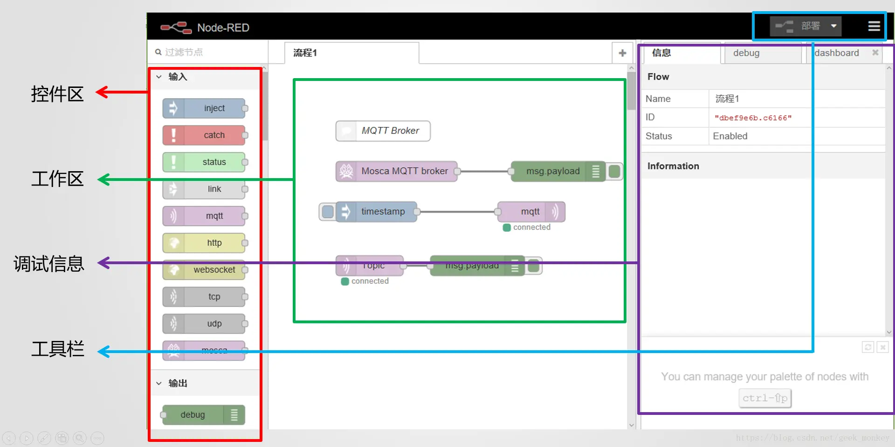

### node-red介绍

Node-RED 是构建物联网(IOT， Internet of Things)应用程序的一个强大工具，其重点是简化代码块的“连接”以执行任务。它使用可视化编程方法，允许开发人员将预定义的代码块（称为“节点”，Node）连接起来执行任务。连接的节点，通常是输入节点、处理节点和输出节点的组合，当它们连接在一起时，构成一个“流”(Flows)。

Node-RED最初是IBM在2013年末开发的一个开源项目，以满足他们快速连接硬件和设备到Web服务和其他软件的需求——作为物联网的一种粘合剂，它很快发展成为一种通用的物联网编程工具。重要的是，Node-RED已经迅速形成一个重要的、不断增长的用户基础和一个活跃的开发人员社区，他们正在开发新的节点，同时允许程序员复用Node-RED代码来完成各种各样的任务。

虽然Node-RED 最初是用来处理物联网的应用，也就是说，它与现实世界交互和控制设备，随着它的发展，它已经成为一个较为开放的物联网开发工具。

## 安装

全局安装
```bash
npm install -g node-red
```
```js
// 启动
node-red

// 打开端口
http://localhost:1880
```

## 组成



node-red由四部分组成：左侧空间区、中间编辑区、右侧调试信息栏、头部工具栏

用户可以拖放node到工作区来创建node的实例，Node-Red为每个node实例赋予了唯一的ID，通过双击**node实例**来编辑单个实例，通过连接node的in和out创建数据流，node实例会记录out口连线的信息，每条线会记录目标node实例的信息


数据流的执行：通过读取用户编辑的数据流信息，可以知道node的类型及可编辑部分的值，据此来创建node的可执行实例；通过读取编辑时连线的信息，可以得到可执行实例间的数据关系，实例间的数据发送和接受是利用Node.js的event模块实现的。

### Events-Nodejs
nodejs核心采用异步事件驱动架构，其中某些类型的对象（触发器）会周期性地触发命名事件来调用函数对象（监听器）。

例如，net.Server 对象会在每次有新连接时触发事件；fs.ReadStream 会在文件被打开时触发事件；流对象 会在数据可读时触发事件。

所有能触发事件的对象都是 EventEmitter 类的实例。 这些对象开放了一个 eventEmitter.on() 函数，允许将一个或多个函数绑定到会被对象触发的命名事件上。 事件名称通常是驼峰式的字符串，但也可以使用任何有效的 JavaScript 属性名。

```js
const EventEmitter = require('events');

class MyEmitter extends EventEmitter {}

const myEmitter = new MyEmitter();
myEmitter.on('event', () => {
  console.log('触发了一个事件！');
});
myEmitter.emit('event');
```


在Node-Red的根目录下，可以通过执行‘node red.js’运行Node-RED。Node-Red编辑完成的数据流默认保存在flows_.json，可以通过执行‘node red.js flows_.json’，在不启动浏览器的情况下执行已经编辑完成的程序，这个在实际部署的时候非常有用。
