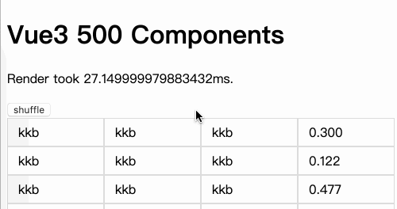

## Vue3 vs Vue2

话不多说直接进入正题

以下采用500个组件做性能测试数据
1.1 **组件挂载阶段**
| **框架** | 首次Mounted阶段 | 平局用时
| --- | --- |  --- | 
| **Vue3** || 19.170ms
| **Vue2** | | 44.025ms

1.2 **组件更新阶段**

| **框架** | undated阶段 | 平局用时
| --- | --- |  --- | 
| **Vue3** || 19.9499ms
| **Vue2** | | 29.57995ms

## 编码上的区别

2.1 **脚手架**

2.2 **钩子函数**

2.3 **组件通信方式**

