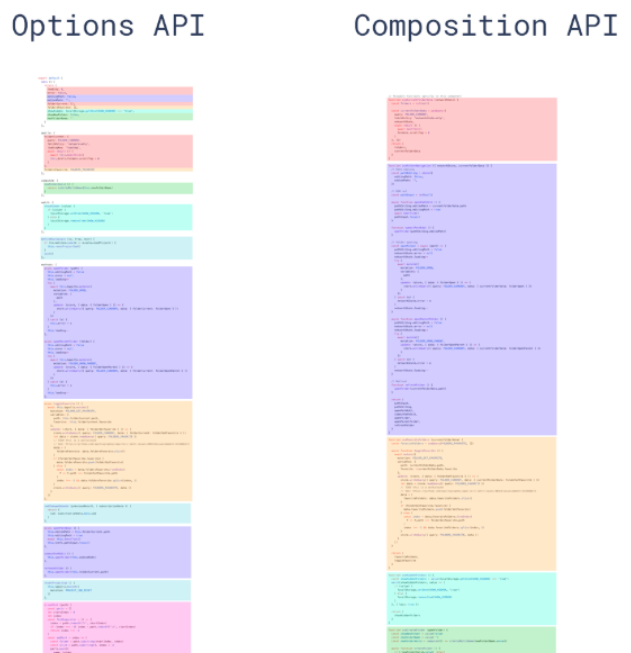

## 介绍vue

Vue (读音 /vjuː/，类似于 view) 是一套用于构建用户界面的渐进式框架。与其它大型框架不同的是，Vue 被设计为可以自底向上逐层应用。Vue 的核心库只关注视图层，不仅易于上手，还便于与第三方库或既有项目整合。

另一方面，当与现代化的工具链以及各种支持类库结合使用时，Vue 也完全能够为复杂的单页应用提供驱动。

MVVM（Model-View-ViewModel）架构
- 『View』：视图层（UI 用户界面）
-  ViewModel』：业务逻辑层（一切 js 可视为业务逻辑）
-  『Model』：数据层（存储数据及对数据的处理如增删改查）

### 回顾vue2 对比 vue3 



## 新特性


 ### 重写双向绑定
 ```js
 vue2
基于Object.defineProperty()实现
 
vue3 基于Proxy
proxy与Object.defineProperty(obj, prop, desc)方式相比有以下优势：
 
//丢掉麻烦的备份数据
//省去for in 循环
//可以监听数组变化
//代码更简化
//可以监听动态新增的属性；
//可以监听删除的属性 ；
//可以监听数组的索引和 length 属性；
 
    let proxyObj = new Proxy(obj,{
        get : function (target,prop) {
            return prop in target ? target[prop] : 0
        },
        set : function (target,prop,value) {
            target[prop] = 888;
        }
    })
```
### Vue3 优化Vdom

在Vue2中,每次更新diff,都是全量对比,Vue3则只对比带有标记的,这样大大减少了非动态内容的对比消耗

Vue Template Explorer 我们可以通过这个网站看到静态标记


patch flag 优化静态树
```js
<span>Hello world!</span>
<span>Hello world!</span>
<span>Hello world!</span>
<span>Hello world!</span>
<span>{{msg}}</span>
<span>Hello world!</span>
<span>Hello world! </span>
```

Vue3 编译后的 Vdom 是这个样子的

```js
export function render(_ctx，_cache，$props，$setup，$data，$options){return (_openBlock(),_createBlock(_Fragment,null，[
_createvNode( "span", null,"Hello world ! "),
_createvNode( "span",null，"Hello world! "),
_createvNode( "span"，null，"Hello world! "),
_createvNode( "span", null，"Hello world! "),
_createVNode("span", null，_toDisplaystring(_ctx.msg)，1/* TEXT */)，
_createvNode( "span", null，"Hello world! "),
_createvNode( "span", null，"Hello world! ")]，64/*STABLE_FRAGMENT */))}
```

新增了 patch flag 标记

```js
TEXT = 1 // 动态文本节点
CLASS=1<<1,1 // 2//动态class
STYLE=1<<2，// 4 //动态style
PROPS=1<<3,// 8 //动态属性，但不包含类名和样式
FULLPR0PS=1<<4,// 16 //具有动态key属性，当key改变时，需要进行完整的diff比较。
HYDRATE_ EVENTS = 1 << 5，// 32 //带有监听事件的节点
STABLE FRAGMENT = 1 << 6, // 64 //一个不会改变子节点顺序的fragment
KEYED_ FRAGMENT = 1 << 7, // 128 //带有key属性的fragment 或部分子字节有key
UNKEYED FRAGMENT = 1<< 8, // 256 //子节点没有key 的fragment
NEED PATCH = 1 << 9, // 512 //一个节点只会进行非props比较
DYNAMIC_SLOTS = 1 << 10 // 1024 // 动态slot
HOISTED = -1 // 静态节点
BALL = -2
```

